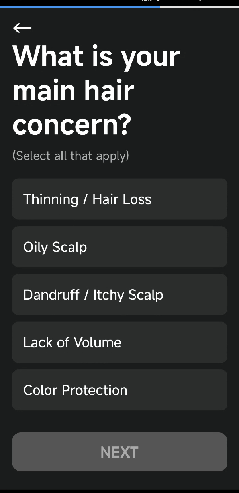
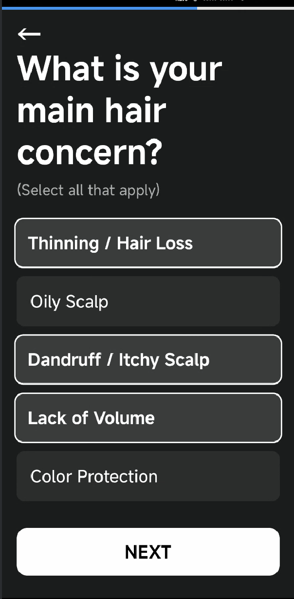
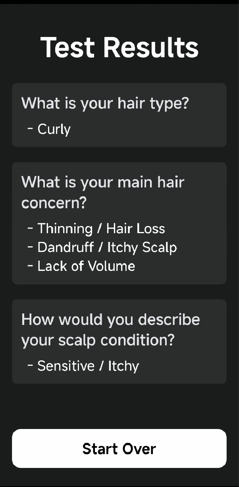

# StepFlowApp - Enhanced User Data Collection Flow

## The Challenge: Engaging Users During Data Collection

Modern applications often require phases dedicated to collecting user information, whether for onboarding, personalization, or specific features (like skin/hair type analysis). Standard forms or flows can sometimes feel tedious, leading to drop-off or disengagement. There's a need for a more focused, intuitive, and visually appealing way to guide users through these crucial steps.

- 

## The Solution: Introducing `StepFlow` Component

`StepFlowApp` demonstrates a dedicated component, **`StepFlow`**, designed specifically to address this challenge. It provides a self-contained, configurable flow for presenting questions and capturing user selections, prioritizing an improved User Experience (UX).

**Core Idea:** Create a distinct, immersive experience for multi-step data collection, making it feel less like a chore and more like an interactive process.

## Key Features & Design Philosophy (POC)

- **Focused UX:** Employs a clean interface with **bold, readable typography** and clear visual cues (like selection states) to minimize cognitive load and enhance clarity.
- **Smooth Transitions:** Designed with smooth screen transitions using React Native Reanimated for fluid progression between steps.
- **Configurable Steps:** The flow is driven by a simple JSON-like configuration, making it easy to define different sequences of questions. Example:

```json
{
  "steps": [
    {
      "id": "q1",
      "question": "What's your preferred development environment?",
      "type": "single",
      "options": [
        {"id": "vscode", "label": "VS Code"},
        {"id": "intellij", "label": "IntelliJ"},
        {"id": "sublime", "label": "Sublime Text"}
      ]
    }
  ]
}
```

## Visual Showcase


**Key Screens:**

- 
- 
- 

## Getting Started

1. **Clone the repository:**

   ```bash
   git clone https://github.com/isouravganguly/StepFlowApp.git
   cd StepFlowApp
   ```

2. **Install dependencies:**

   ```bash
   yarn install
   ```

3. **Install Pods (for iOS):**

   ```bash
   cd ios && pod install && cd ..
   ```

4. **Configure Firebase:**

   - Follow the [React Native Firebase setup guide](https://rnfirebase.io/) to add your `GoogleService-Info.plist` (iOS) and `google-services.json` (Android).
   - Create a Firestore database with the following structure:
     ```
     /tests/{testId}/config: Step[]
     ```

5. **Run the app:**
   - iOS:
     ```bash
     yarn ios
     ```
   - Android:
     ```bash
     yarn android
     ```

## Next Steps & Future Considerations

- Implement robust input validation based on `Step.validation` rules
- Add subtle animations for screen transitions and option selections
- Integrate actual user authentication to replace placeholder logic
- Develop comprehensive unit and integration tests
- Explore integration with global state management and navigation if/when the `StepFlow` needs to interact more deeply with a larger application context

## Tech Stack

- React Native 0.79.1
- React Native Reanimated for smooth animations
- Firebase/Firestore for configuration and data storage
- TypeScript for type safety
- React Native Gesture Handler for touch interactions

## Contributing

Feel free to open issues and pull requests for any improvements you'd like to suggest!

## License

MIT
